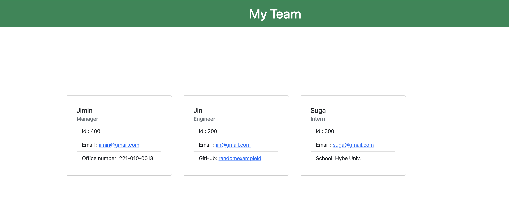

# teamorgchart
## Description
In this project, I created team org chart creator by using JavaScript. If you answer the questions about your team (Manger, Engineer, Intern), you will asked to answer for common/unique questions per position and HTML file will be created once you are done.

## Video Walkthrough

## Test Video

## Preview

## Lesson Learned
* Be aware of typos
* Make sure to update estimated answers as you change
* Install jest (npm install jest --save-dev) before use "npm run test"
